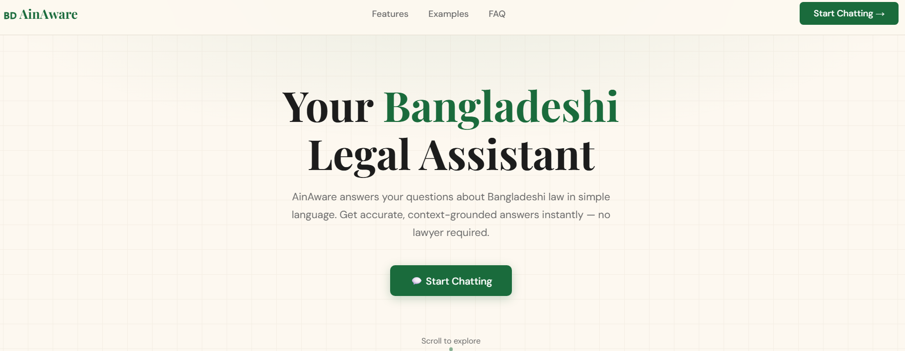
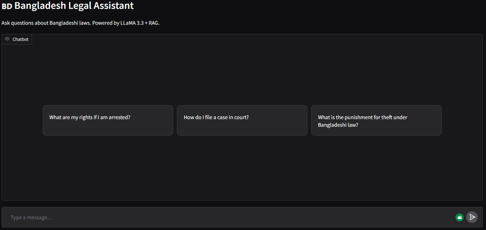

# 🇧🇩 AinAware — Bangladeshi Paralegal AI Assistant

> A Retrieval-Augmented Generation (RAG) powered legal assistant that makes Bangladeshi law accessible to the general public in plain, simple language.

<p align="center">
  
  <br/>
</p>

**Live Demo:** [Hugging Face Space](https://huggingface.co/spaces/goldphish2209/AinAware__Bangladeshi_Paralegal_Chatbot)


**Website:** [GitHub Pages](https://YOUR_GITHUB_USERNAME.github.io/YOUR_REPO)

---

## Overview

AinAware is an AI-powered paralegal chatbot designed to bridge the gap between complex Bangladeshi laws and the everyday citizen. Users can ask questions about their rights, court procedures, family law, property disputes, and more — and receive clear, cited answers grounded in real legal documents. **The motto of this project is to make the people more aware of their rights and make legal information more accessible.**

The system achieves a **RAGAS Faithfulness score of 1.00**, meaning every generated answer is fully supported by the retrieved legal context with no hallucination.

---

## Features

- **Plain Language Answers** — Legal questions answered in simple, everyday English without jargon
- **Source Citations** — Every response includes the exact page references from the source document
- **Context-Aware Conversation** — Remembers recent conversation turns for natural follow-up questions
- **Stays On Topic** — Refuses to answer questions outside the scope of the legal corpus
- **Multi-Turn Chat** — Built with Gradio's ChatInterface for a smooth conversational experience
- **Web Frontend** — Separate GitHub Pages site with a live chat interface powered by the Gradio API

---

## Tech Stack


| Component | Technology |
|---|---|
| LLM | LLaMA 3.3 70B Versatile via Groq |
| Orchestration | LangChain |
| Embeddings | `sentence-transformers/all-MiniLM-L6-v2` (HuggingFace) |
| Chunking | LangChain Semantic Chunker (percentile, threshold 95) |
| Vector Store | FAISS |
| Retrieval | Similarity search, top-k = 5 |
| UI | Gradio ChatInterface |
| Deployment | Hugging Face Spaces |
| Frontend | HTML/CSS/JS — GitHub Pages |
| Evaluation | RAGAS |

---

## Architecture

```
User Question
      │
      ▼
 Gradio Chat UI
      │
      ▼
 Retriever (FAISS)
 ┌────────────────────────────────┐
 │  Semantic Chunks + Embeddings  │
 │  (bd_laws.pdf)          │
 └────────────────────────────────┘
      │  Top-5 relevant passages
      ▼
 PromptTemplate
 {context} + {question} + history
      │
      ▼
 LLaMA 3.3 70B (Groq)
      │
      ▼
 Cited Answer → User
```

---

## Evaluation

AinAware was evaluated using the [RAGAS](https://docs.ragas.io/) framework on a set of question-answer pairs generated from the legal corpus.

| Metric | Score |
|---|---|
| **Faithfulness** | **1.00** |

A faithfulness score of 1.00 means all claims in the generated answers are fully grounded in the retrieved context — the model does not fabricate or hallucinate information beyond what the documents contain.

---

## Project Structure

```
├── app.py                  # Main Gradio application
├── requirements.txt        # Python dependencies
├── data/
│   └── bd_laws.pdf  # Bangladeshi legal corpus (tracked via Git LFS)
├── faiss_index/
│   ├── index.faiss         # FAISS vector index (tracked via Git LFS)
│   └── index.pkl           # Document metadata mappings
└── docs/                   # GitHub Pages frontend
    ├── index.html          # Landing page
    └── chat.html           # Chat interface (connects to HF Spaces via API)
```

---

## Getting Started

### Prerequisites

- Python 3.10+
- A [Groq API key](https://console.groq.com/) (I used Groq but you can use anything befitting)

### Installation

```bash
git clone https://github.com/Naawshin/AinAware---A-Bangladeshi-Paralegal-Chatbot.git
cd AinAware---A-Bangladeshi-Paralegal-Chatbot

# Install dependencies
pip install -r requirements.txt

# Set up environment variables
echo "GROQ_API_KEY=your_key_here" > .env
```

### Run the App

```bash
python app.py
```

The Gradio interface will launch at `http://localhost:7860`.
<p align="center">
  
  <br/>
  <em>Gradio Chatbot Interface</em>
</p>

### Rebuild the FAISS Index (optional)

If you want to re-index with a different PDF, update the path in `app.py`,uncomment the semantic chunker, load from the documents and re-run. The index files will be regenerated automatically. Make sure to comment out or remove the faiss.load_local option. However, it is advised to use pre downloaded index so it won't take up time splitting and embedding the document every time the app starts.   

use `vector_store.save_local("index file name")` to save the index file for local loading.

---

## Requirements

```
langchain
langchain-groq
langchain-huggingface
langchain-community
langchain-experimental
faiss-cpu
sentence-transformers
pypdf
gradio
python-dotenv
ragas
```

---

## Example Questions

- What are my rights if I am arrested?
- How do I file a case in court?
- What are tenant rights in Bangladesh?
- What is the punishment for theft under Bangladeshi law?
- How does divorce work under Bangladeshi law?
- How do I register a business in Bangladesh?

---

## Limitations

- AinAware is limited to the content of the provided legal corpus (`bd_laws.pdf`). It will not answer questions outside this scope.
- This tool provides **general legal information only** and is not a substitute for advice from a qualified lawyer.
- Laws may have been amended after the document was compiled. Always verify with an up-to-date source for critical matters.

---
## Author

**Nowshin Tabasum** | AI Engineer

</div>

---

**🔗 Connect with me:**

[](https://github.com/YOUR_GITHUB_USERNAME)
[](mailto:nowshintabasum004@gmail.com)

---
## License

This project is for educational purposes. The underlying legal documents belong to the Government of Bangladesh.